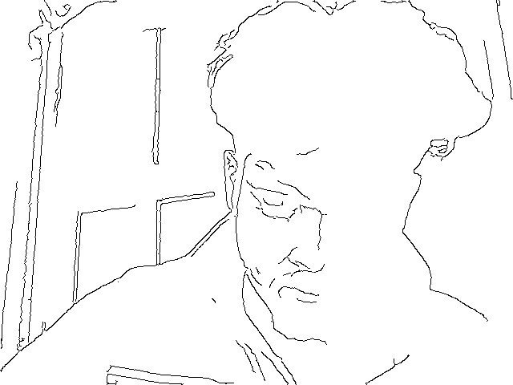

# sketchUP - Go Sketch Yourself
This program manipulates frames from a live webcam stream to look like a sketch.

Each frame is converted into a grayscale image then  a gaussian blur is applied to smoothen out the image. Edges are extracted from the image using a Canny Edge Detector. The images is then binarized using *cv2.threshold()* and this is how we get the sketch.

## Requirements
1. Numpy
2. opencv-python.

## Instructions
1. Press Q to quit.
2. Press S to capture the image. 

Captured Images can be found in the *Captures* Folder.
